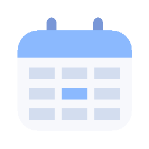

<p align="center">
  
</p>

<h1 align="center">Calendar Hover Bar</h1>

<p align="center">
  An aesthetic, always-on-top Google Calendar widget for Windows.<br>
  A small semi-transparent arrow lives on the edge of your screen — hover it to
  scan what's coming up, at a glance.
</p>

---

Hover the arrow and a glassy panel slides out with your upcoming **Google Calendar
events and Tasks**. Add events by typing in plain English, glance at color-coded
urgency, and jump straight into a meeting that's about to start. **Drag** the arrow
anywhere — it snaps to the nearest side and remembers where you put it.

## Features

- **Glanceable timeline** — events + tasks grouped Today / Tomorrow / Later, with
  per-calendar colors and undated to-dos.
- **Urgency at a glance** — today's items tinted coral, tomorrow's amber.
- **Imminent-meeting bar** — when a meeting is about to start, the arrow becomes an
  "up next" bar with a one-click **Join** button (Google Meet / Zoom / Teams, etc.).
- **Add events by typing** — natural-language quick-add (`Lunch with Sam 1pm Friday`),
  plus reusable **presets** for recurring spots.
- **Quick actions** — check off tasks, delete events, click any item for a detail popup.
- **Tuneable & unobtrusive** — semi-transparent, click-through, configurable look-ahead
  window and meeting-alert lead time. Lives in the system tray; auto-starts at login.

## One-time Google setup (~5–10 min, free)

The widget talks to the Google Calendar + Tasks API using your own OAuth
credentials. Everything stays local on your machine.

1. **Create a project** — [console.cloud.google.com/projectcreate](https://console.cloud.google.com/projectcreate).
2. **Enable APIs** — turn on the
   [Google Calendar API](https://console.cloud.google.com/apis/library/calendar-json.googleapis.com)
   and the [Google Tasks API](https://console.cloud.google.com/apis/library/tasks.googleapis.com).
3. **OAuth consent screen** — choose **External**, fill the required name/email,
   and add your own Google address as a **test user**.
   Then set the **publishing status to "In production"** (you do *not* need to
   submit for verification). This stops Google from expiring your login every 7 days.
4. **Create credentials** — [Credentials](https://console.cloud.google.com/apis/credentials)
   → *Create credentials* → *OAuth client ID* → **Desktop app**.
5. Copy the **Client ID** and **Client secret**.
6. In the widget: hover the arrow → **⚙ gear** → paste both → **Connect Google**.
   A browser opens; sign in. You'll see a *"Google hasn't verified this app"* screen —
   click **Advanced → Go to (app) (unsafe)** (it's your own app). Done — the settings
   panel collapses back to the scannable view.

## Using it

- **Hover** the arrow → events + tasks grouped Today / Tomorrow / Later. Header shows
  time to your next event.
- **Add an event** → type into the box at the bottom (e.g. `Lunch with Sam 1pm Friday`)
  and press Enter. Tap a **preset** chip to pre-fill it, or **+ New** to make your own.
- **Click an item** → detail popup with time, location, description, and a clickable
  title that opens it in Google Calendar.
- **Check off a task** (click its circle) or **delete an event** (trash icon → confirm).
- **Drag** the arrow to reposition; drag past the screen midline to flip sides.
- **Settings** (⚙): connect/disconnect Google, choose which calendars show, toggle
  Tasks, set the look-ahead window and meeting-alert lead time, start-at-login.
- **System tray icon**: refresh, settings, start-at-login, quit.

## Running from source

```bash
npm install      # first time only
npm start
```

Auto-launches at login by default (toggle in settings or the tray menu).

### Build a standalone installer

```bash
# CSC_IDENTITY_AUTO_DISCOVERY=false skips Windows code-signing tooling you don't need
CSC_IDENTITY_AUTO_DISCOVERY=false npm run dist
```

Produces a per-user NSIS installer in `dist/`. Running it installs the app, adds
Start Menu / desktop shortcuts, and registers it to start at login.

## How it works

- **Electron** transparent overlay; click-through everywhere except the arrow/panel
  (`setIgnoreMouseEvents` with forwarding) so it never blocks apps behind it. Leaves a
  small bottom gap so it doesn't fight an auto-hide taskbar.
- **googleapis** in the main process: OAuth loopback flow, `events.list` (recurring
  expanded server-side), `tasks.list`, `events.quickAdd`, plus delete/complete.
- Config + tokens live in `%APPDATA%/calendar-hover-bar/config.json` — **local only**,
  never committed or sent anywhere.

## Tweaking the look

- **App / tray icon** — edit `build/icon.png` (or the generator `build/make-icon.js`,
  then `node build/make-icon.js`), and rebuild.
- **Colors, sizes, blur, transparency** — CSS variables at the top of
  `renderer/styles.css` (`--bg`, `--accent`, `--arrow-w`, `--panel-w`, …).

## License

[MIT](LICENSE) © Yuhang Wu
